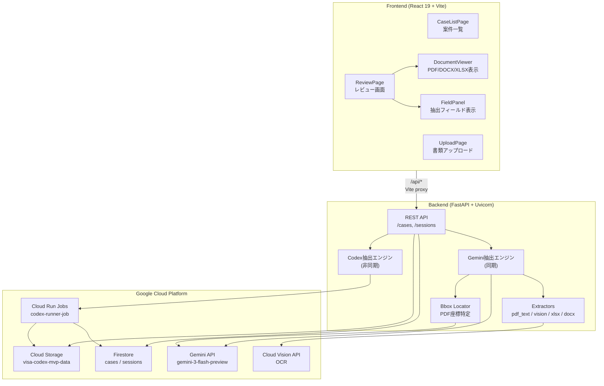
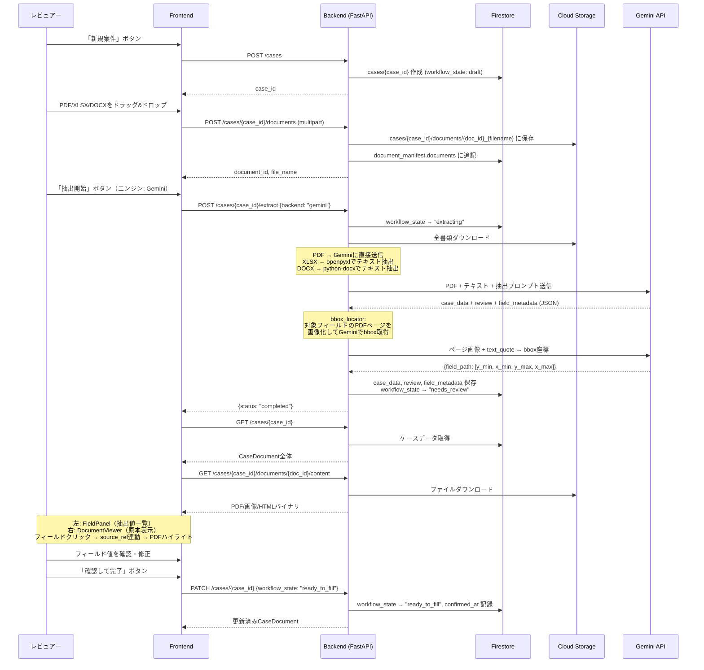
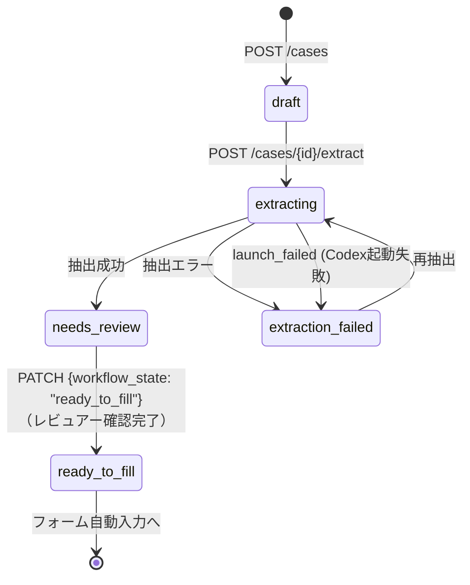

# visa-app 全体設計ドキュメント

## 1. visa-appとは

visa-appは、在留資格申請（主に「技術・人文知識・国際業務」＝技人国）の書類レビューを支援するWebアプリケーションである。申請人の書類（PDF、Excel、Word等）をアップロードすると、Gemini APIまたはCodex CLIで構造化データを自動抽出し、人間のレビュアーが左右分割画面で抽出結果と原本を見比べながら確認・修正できる。レビュー完了後は「入力準備完了」状態となり、RASENSなどの申請フォームへの自動入力に使えるデータが確定する。

---

## 2. 全体アーキテクチャ図



---

## 3. ディレクトリ構成と役割

```
visa-app/
├── frontend/                    # React 19 SPA
│   ├── src/
│   │   ├── api/
│   │   │   ├── client.ts        # APIクライアント（デモモード対応）
│   │   │   └── mockData.ts      # デモ用モックデータ
│   │   ├── components/
│   │   │   ├── review/          # レビュー画面コンポーネント群
│   │   │   │   ├── FieldPanel.tsx      # 抽出フィールド一覧・編集
│   │   │   │   ├── FieldRow.tsx        # フィールド1行の表示
│   │   │   │   ├── FieldSection.tsx    # セクション（申請人、学歴等）
│   │   │   │   ├── FlagBadge.tsx       # 警告バッジ
│   │   │   │   └── ReviewBanner.tsx    # 上部ステータスバナー
│   │   │   ├── upload/          # アップロード画面コンポーネント
│   │   │   │   ├── DropZone.tsx        # ドラッグ&ドロップ領域
│   │   │   │   ├── ExtractionProgress.tsx  # 抽出進捗表示
│   │   │   │   └── FileList.tsx        # アップロード済みファイル一覧
│   │   │   └── viewer/          # 書類ビューアコンポーネント
│   │   │       ├── DocumentViewer.tsx  # ビューア統合（PDF/画像/Office切替）
│   │   │       ├── PdfViewer.tsx       # PDF.js描画 + bboxハイライト
│   │   │       ├── ImageViewer.tsx     # 画像表示
│   │   │       └── HtmlViewer.tsx      # DOCX/XLSX HTML変換表示
│   │   ├── pages/
│   │   │   ├── CaseListPage.tsx # 案件一覧（新規作成）
│   │   │   ├── UploadPage.tsx   # 書類アップロード＋抽出開始
│   │   │   └── ReviewPage.tsx   # 左右分割レビュー画面
│   │   ├── store/
│   │   │   └── viewerStore.ts   # Zustand: ビューア状態管理
│   │   ├── types/
│   │   │   └── caseData.ts      # TypeScript型定義（全データ構造）
│   │   └── App.tsx              # ルーティング定義
│   └── package.json
│
├── backend/                     # FastAPI サーバー
│   ├── main.py                  # 全エンドポイント定義
│   ├── extractors/
│   │   ├── types.py             # データクラス（OcrResult, ExtractionResult等）
│   │   ├── gemini.py            # Gemini API呼び出し・JSON構造化抽出
│   │   ├── bbox_locator.py      # Gemini bbox座標取得（PDFハイライト用）
│   │   ├── prompt_template.py   # Gemini抽出プロンプトテンプレート
│   │   ├── pdf_text.py          # PyMuPDFテキストレイヤー抽出
│   │   ├── vision.py            # Cloud Vision API OCR
│   │   ├── xlsx.py              # openpyxl Excel抽出
│   │   └── docx_text.py         # python-docx Word抽出
│   ├── requirements.txt
│   └── Dockerfile
│
└── jobs/
    └── codex-runner/            # Cloud Run Job コンテナ
        ├── entrypoint.sh        # Codex CLI実行スクリプト
        ├── gcs_helper.py        # GCSアップロード/ダウンロード
        ├── update_status.py     # Firestoreステータス更新
        ├── Dockerfile
        └── requirements.txt
```

---

## 4. データフロー



---

## 5. 具体シナリオ：「技人国」申請のケース

### 5.1 書類構成

以下の3つの書類がアップロードされた場合を想定する。

| 書類 | 形式 | document_role | 内容 |
|------|------|---------------|------|
| オファーレター | PDF | applicant_document_bundle | 雇用条件（職名、給与、勤務地、雇用期間） |
| 会社書類 | PDF | applicant_document_bundle | 会社概要（会社名、資本金、代表者、事業内容、法人番号） |
| 申請人情報Excel | XLSX | applicant_document_bundle | 申請人の氏名、生年月日、国籍、学歴、職歴等 |

### 5.2 抽出パイプライン

1. **ファイル種別判定** (`main.py: _extract_with_gemini`)
   - PDF 2件 → `pdf_contents` に分類
   - XLSX 1件 → `extractors/xlsx.py: extract_xlsx` でテキスト抽出 → `text_contents` に分類

2. **抽出パターン決定** (`pattern: "auto"`)
   - PDFが存在するため `pdf_direct` パターンが選択される

3. **Gemini API呼び出し** (`gemini.py: extract_pdf_direct`)
   - PDF 2件はバイナリのまま `Part.from_bytes` でGeminiに送信
   - XLSXのテキスト抽出結果はプロンプト内にテキストとして埋め込み
   - プロンプトテンプレート（`prompt_template.py`）で在留資格申請用の構造化指示を付与

4. **bbox座標取得** (`bbox_locator.py: locate_bboxes`)
   - 対象フィールド（`BBOX_TARGET_FIELDS`: 最大20項目）の `source_refs` をグルーピング
   - 該当PDFページをPyMuPDFで300dpi PNG画像化
   - Geminiに画像＋text_quoteを送って0-1000正規化座標のbboxを取得

### 5.3 各書類から抽出されるフィールド

**オファーレターPDF → employment_conditions / employment_terms**

```python
# field_metadata の例（実際のGemini出力に基づく）
{
    "employment_conditions.job_title": {
        "source_refs": [{
            "document_id": "doc_abc123",
            "page": 1,
            "text_quote": "Software Engineer",
            "confidence": 0.95,
            "bbox": {"y_min": 320, "x_min": 150, "y_max": 345, "x_max": 400}
        }]
    },
    "employment_conditions.monthly_salary": {
        "source_refs": [{
            "document_id": "doc_abc123",
            "page": 1,
            "text_quote": "350,000円",
            "confidence": 0.92,
            "bbox": {"y_min": 380, "x_min": 200, "y_max": 405, "x_max": 350}
        }]
    },
    "employment_conditions.work_location": { ... }
}
```

**会社書類PDF → employer**

```python
{
    "employer.company_name": {
        "source_refs": [{
            "document_id": "doc_def456",
            "page": 1,
            "text_quote": "株式会社テクノロジーズ",
            "confidence": 0.95,
            "bbox": {"y_min": 50, "x_min": 100, "y_max": 80, "x_max": 500}
        }]
    },
    "employer.capital": { ... },
    "employer.representative_name": { ... },
    "employer.business_type": { ... },
    "employer.corporate_number": { ... }
}
```

**申請人情報XLSX → applicant / education / employment_history**

```python
# XLSXにはbboxなし（テキスト抽出のみ）
{
    "applicant.name_roman": {
        "source_refs": [{
            "document_id": "doc_ghi789",
            "page": 1,  # シート番号
            "text_quote": "NGUYEN VAN ANH",
            "confidence": 0.9
        }]
    },
    "applicant.date_of_birth": { ... },
    "applicant.nationality_region": { ... },
    "education.0.school_name": { ... },
    "education.0.major": { ... },
    "employment_history.0.company_name_en": { ... }
}
```

### 5.4 レビュー画面の表示

ReviewPageは左右分割レイアウトで構成される（分割比率はドラッグで調整可能）。

**左パネル（FieldPanel）:**
- セクションごとにフィールドを表示（申請人情報、出入国歴、学歴、職歴、雇用主、雇用条件、活動内容等）
- 各フィールドに confidence に応じた色分けバッジ
- `review.missing_items` / `validation_errors` / `findings` に該当するフィールドには警告バッジ
- フィールドをクリックすると viewerStore 経由で右パネルの書類該当箇所にジャンプ
- 値は直接編集可能（編集すると `human_edited: true` がセット）
- セクション単位で「確認済み」マーク可能

**右パネル（DocumentViewer）:**
- PDFは pdfjs-dist で描画、bbox情報があればハイライト矩形をオーバーレイ
- DOCX/XLSXはバックエンドでHTML変換して HtmlViewer で表示
- 画像は ImageViewer で表示
- タブで書類切り替え、XLSXはシート切り替えも可能

**上部（ReviewBanner）:**
- workflow_state の表示
- 未レビューフィールド数、警告数のサマリ

**下部（確認バー）:**
- 「確認して完了」ボタン → workflow_state を `ready_to_fill` に遷移

---

## 6. 状態遷移



### 状態一覧

| workflow_state | 日本語ラベル | 説明 |
|---|---|---|
| `draft` | 下書き | ケース作成直後。書類未アップロード |
| `extracting` | 抽出中 | Gemini/Codexで書類を解析中 |
| `extraction_failed` | 抽出失敗 | 抽出処理がエラーで終了 |
| `needs_review` | 要レビュー | 抽出完了。人間の確認待ち |
| `ready_to_fill` | 入力準備完了 | レビュアーが確認完了。フォーム入力可 |
| `archived` | アーカイブ | 処理済み（UI定義あり、遷移ロジック未実装） |
| `launch_failed` | 起動失敗 | Cloud Run Job起動失敗（Codexバックエンド） |

---

## 7. 技術スタック一覧

### Frontend

| 技術 | バージョン | 用途 |
|------|-----------|------|
| React | 19.x | UIフレームワーク |
| Vite | 8.x | ビルドツール + 開発サーバー + `/api` プロキシ |
| TypeScript | 6.x | 型安全 |
| Tailwind CSS | 4.x | スタイリング |
| React Router | 7.x | ルーティング（`/`, `/cases/:id/upload`, `/cases/:id/review`） |
| Zustand | 5.x | 状態管理（viewerStore: ドキュメント表示状態、ハイライト連動） |
| pdfjs-dist | 5.x | PDFレンダリング + bboxハイライト描画 |
| Playwright | 1.x | E2Eテスト |

### Backend

| 技術 | 用途 |
|------|------|
| FastAPI + Uvicorn | REST API サーバー |
| google-genai (Gemini SDK) | Gemini 3 Flash による構造化抽出 + bbox座標取得 |
| google-cloud-firestore | ケース・セッションのデータ永続化 |
| google-cloud-storage | 書類ファイル保存（GCSバケット: `visa-codex-mvp-data`） |
| google-cloud-vision | OCR（テキストレイヤーなしPDF・画像用） |
| google-cloud-run | Cloud Run Jobs（Codex非同期実行） |
| PyMuPDF (pymupdf) | PDFテキスト抽出 + ページ画像化（bbox用300dpi PNG） |
| openpyxl | Excelテキスト抽出 + HTML変換プレビュー |
| python-docx | Wordテキスト抽出 + HTML変換プレビュー |

### Infrastructure (GCP)

| リソース | 値 |
|----------|-----|
| GCPプロジェクト | `visa-codex-mvp` |
| リージョン | `asia-northeast1` |
| GCSバケット | `visa-codex-mvp-data` |
| Firestoreコレクション | `cases`, `sessions` |
| Cloud Run Job | `codex-runner-job` |
| Geminiモデル | `gemini-3-flash-preview` |

### 主要データ型（TypeScript）

```typescript
// CaseDocument — Firestoreに保存されるケース全体
interface CaseDocument {
  case_id: string
  workflow_state: string           // draft | extracting | needs_review | ready_to_fill | ...
  case_data: CaseData             // 抽出された申請人データ全体
  field_metadata: FieldMetadataMap // 各フィールドの抽出根拠
  review: Review                  // レビュー所見（欠損・矛盾・警告）
  document_manifest: DocumentManifest  // アップロード済み書類一覧
  confirmed_at?: string | null    // レビュー確認日時
}

// FieldMeta — フィールドごとの抽出根拠
interface FieldMeta {
  source_refs: SourceRef[]        // 根拠となる書類箇所のリスト
  human_reviewed?: boolean        // 人間が確認済みか
  human_edited?: boolean          // 人間が値を修正したか
}

// SourceRef — 書類上の根拠箇所
interface SourceRef {
  document_id: string             // 書類ID
  page: number                    // ページ番号（1始まり）
  text_quote: string              // 原文引用（50文字以内）
  confidence: number              // 確信度 0.0-1.0
  bbox?: {                        // PDF上の座標（0-1000正規化）
    y_min: number; x_min: number
    y_max: number; x_max: number
  }
}

// ExtractionResult — バックエンドの抽出結果（Python dataclass）
@dataclass
class ExtractionResult:
    case_data: dict               # 申請人の構造化データ
    review: dict                  # レビュー所見
    field_metadata: dict          # フィールド根拠マップ
```
