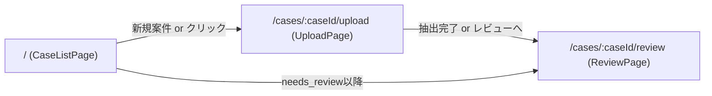
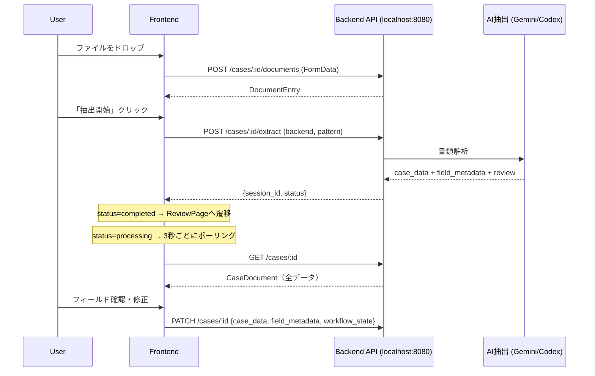
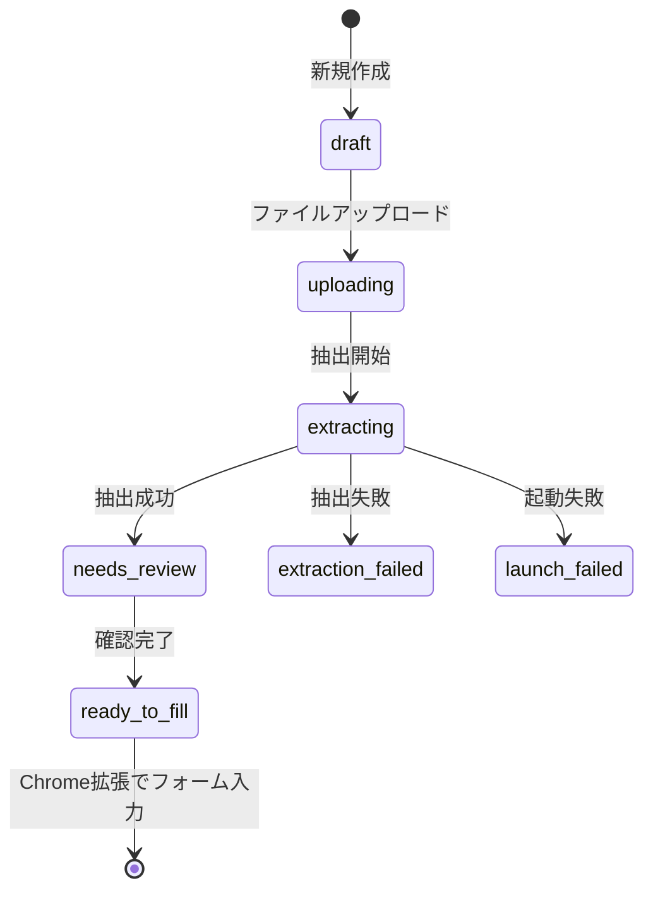

# visa-reviewer アーキテクチャドキュメント

> **注記** (2026-05-17): ディレクトリ再編により `visa-reviewer/` は `visa-app/frontend/` に移動しました。

## 概要

`visa-reviewer` は在留資格申請書類のレビュー支援Webアプリケーション。
書類アップロード → AI抽出（OCR/構造化） → 人間によるレビュー・修正 → 確認完了、というワークフローを提供する。

---

## 技術スタック

| レイヤー | 技術 |
|---------|------|
| フレームワーク | React 19 + TypeScript 6 |
| ビルドツール | Vite 8 |
| ルーティング | react-router-dom 7 |
| 状態管理 | Zustand 5 |
| スタイリング | Tailwind CSS 4（Viteプラグイン） |
| PDF表示 | pdfjs-dist 5.7 |
| テスト | Playwright（E2E） |
| Linter | ESLint 10 |

バックエンドは別プロセス（`localhost:8080`）で動作し、Viteの開発サーバーが `/api` パスをプロキシする構成。

---

## ディレクトリ構成

```
visa-app/frontend/
├── src/
│   ├── main.tsx              # エントリポイント（BrowserRouter設定）
│   ├── App.tsx               # ルーティング定義
│   ├── index.css             # Tailwind読み込み
│   ├── api/
│   │   ├── client.ts         # APIクライアント（デモモード切替付き）
│   │   └── mockData.ts       # デモ用モックデータ
│   ├── types/
│   │   └── caseData.ts       # 全型定義（CaseDocument, Review等）
│   ├── store/
│   │   └── viewerStore.ts    # Zustandストア（ドキュメントビューア状態）
│   ├── lib/
│   │   ├── fieldPaths.ts     # フィールドパス→日本語ラベル変換、値のフラット化
│   │   └── buildApplicationData.ts  # Chrome拡張向けオートフィルデータ生成
│   ├── pages/
│   │   ├── CaseListPage.tsx  # 案件一覧
│   │   ├── UploadPage.tsx    # 書類アップロード + 抽出開始
│   │   └── ReviewPage.tsx    # レビュー画面（メイン）
│   └── components/
│       ├── upload/
│       │   ├── DropZone.tsx          # D&Dファイルアップロード
│       │   ├── FileList.tsx          # アップロード済みファイル一覧
│       │   └── ExtractionProgress.tsx # 抽出進捗表示
│       ├── review/
│       │   ├── FieldPanel.tsx        # フィールド一覧パネル（左ペイン）
│       │   ├── FieldRow.tsx          # 個々のフィールド行
│       │   ├── FieldSection.tsx      # セクション（折りたたみ）
│       │   ├── FlagBadge.tsx         # ステータスバッジ（OK/要確認/不足等）
│       │   └── ReviewBanner.tsx      # 上部ステータスバナー
│       └── viewer/
│           ├── DocumentViewer.tsx    # ドキュメント表示切替（タブ）
│           ├── PdfViewer.tsx         # PDF描画 + ハイライト
│           ├── HtmlViewer.tsx        # DOCX/XLSX HTMLプレビュー
│           └── ImageViewer.tsx       # 画像表示
├── e2e/                      # Playwrightテスト
├── public/                   # 静的ファイル
├── vite.config.ts            # Vite設定（プロキシ含む）
└── package.json
```

---

## ページ遷移（ルーティング）



| パス | ページ | 役割 |
|------|--------|------|
| `/` | CaseListPage | 案件一覧表示、新規作成 |
| `/cases/:caseId/upload` | UploadPage | ファイルアップロード、抽出エンジン選択・実行 |
| `/cases/:caseId/review` | ReviewPage | 2ペインレビュー画面 |

---

## データフロー



---

## 主要データ構造

### CaseDocument（案件全体を表す最上位オブジェクト）

```typescript
interface CaseDocument {
  case_id: string
  workflow_state: string   // draft | uploading | extracting | needs_review | ready_to_fill | archived
  created_at: string
  updated_at: string
  case_data: CaseData           // 申請人・申請内容・雇用主等の構造化データ
  field_metadata: FieldMetadataMap  // 各フィールドの証跡・信頼度
  review: Review                // AIレビュー結果
  document_manifest: DocumentManifest  // アップロード書類一覧
  applicant_name_preview?: string
}
```

### CaseData（申請データ本体）

```typescript
interface CaseData {
  schema_version: string
  case: CaseMeta              // 案件メタ（ID、種別、対象資格、ワークフロー）
  applicant: Applicant        // 国籍、氏名、生年月日、連絡先等
  application: Application    // 希望資格、入国予定、活動内容詳細
  passport?: Passport
  residence_card?: ResidenceCard
  immigration_history?: ImmigrationHistory
  family?: Family
  education?: Education[]
  transcript_subjects?: TranscriptSubject[]
  employment_history?: EmploymentRecord[]
  qualifications?: Qualification[]
  employer?: Employer         // 所属機関（資本金、従業員数等）
  proxy?: Record<string, unknown>
  supporting_documents?: SupportingDocument[]
  assessments?: Assessment[]
}
```

### FieldMetadataMap（フィールドごとの証跡情報）

```typescript
type FieldMetadataMap = Record<string, FieldMeta>

interface FieldMeta {
  source_refs: SourceRef[]     // どの書類のどのページから抽出したか
  human_reviewed?: boolean     // 人間が確認済みか
  human_edited?: boolean       // 人間が編集したか
  original_value?: string      // 編集前の値
}

interface SourceRef {
  document_id: string          // DocumentEntryのID
  page: number                 // ページ番号
  text_quote: string           // 抽出元テキスト
  confidence: number           // 0.0〜1.0
  bbox?: {                     // Gemini bbox座標（千分率）
    y_min: number; x_min: number
    y_max: number; x_max: number
  }
}
```

### Review（AIレビュー結果）

```typescript
interface Review {
  schema_version?: string
  case_id?: string
  expected_route?: 'ok' | 'needs_review' | 'needs_information' | 'human_required'
  missing_documents?: ReviewItem[]   // 不足書類
  missing_items?: ReviewItem[]       // 不足項目（パス + 理由）
  validation_errors?: ReviewItem[]   // 整合性エラー
  findings?: Finding[]               // 指摘事項（severity付き）
  assessments?: ReviewAssessment[]   // 総合評価
}

interface Finding {
  code: string                       // e.g. 'ACTIVITY_BROAD', 'EDUCATION_MATCH_PARTIAL'
  severity: 'low' | 'medium' | 'high' | 'critical'
  message: string
}
```

### DocumentManifest

```typescript
interface DocumentManifest {
  documents: DocumentEntry[]
}

interface DocumentEntry {
  document_id: string
  document_role: string    // passport, resume, intake_spreadsheet等
  file_name: string
  gcs_path: string         // GCS上のパス
  extension?: string
  page_count?: number
  uploaded_at?: string
}
```

---

## API設計

バックエンドのベースURL: `/api`（Viteプロキシで `localhost:8080` に転送）

| メソッド | エンドポイント | 説明 |
|---------|---------------|------|
| POST | `/cases` | 新規案件作成 |
| GET | `/cases` | 案件一覧取得 |
| GET | `/cases/:caseId` | 案件詳細（CaseDocument全体） |
| PATCH | `/cases/:caseId` | 案件更新（case_data, field_metadata, workflow_state） |
| POST | `/cases/:caseId/documents` | ファイルアップロード（FormData） |
| GET | `/cases/:caseId/documents` | ドキュメント一覧 |
| GET | `/cases/:caseId/documents/:docId/url` | 署名付きURL取得 |
| GET | `/cases/:caseId/documents/:docId/content` | ファイル直接取得 |
| GET | `/cases/:caseId/documents/:docId/preview` | HTML変換プレビュー（DOCX/XLSX用） |
| GET | `/cases/:caseId/documents/:docId/sheets` | XLSXシート名一覧 |
| POST | `/cases/:caseId/extract` | 抽出開始（`{backend, pattern}`） |
| GET | `/cases/:caseId/extraction-status` | 抽出ステータス確認 |

### デモモード

`?demo=true` パラメータまたは `VITE_DEMO=true` 環境変数で有効化。
APIコールがモックデータを返し、バックエンド不要で動作確認可能。

---

## 状態管理

### Zustand Store（viewerStore）

ドキュメントビューアの表示状態を管理する単一ストア。

```typescript
interface ViewerState {
  documents: DocumentEntry[]          // 全アップロード書類
  currentDocumentId: string | null    // 表示中の書類
  currentPage: number                 // 表示中のページ
  highlightText: string | null        // ハイライト対象テキスト
  highlightSourceRef: SourceRef | null // bbox付きハイライト情報
  signedUrls: Record<string, string>  // docId → 署名付きURL
  activeFieldPath: string | null      // 左パネルで選択中のフィールド
}
```

主なアクション:
- `navigateToSource(ref)`: SourceRefを受け取り、該当書類の該当ページに遷移しハイライト表示
- `setPage(page)`: ページ変更（ハイライトクリア）
- `setActiveFieldPath(path)`: フィールド選択

### ローカルState（ReviewPage）

- `caseDoc: CaseDocument | null` — 案件全データ
- `splitRatio` — 左右ペインの分割比率（ドラッグで変更可能）
- フィールド編集は `handleFieldUpdate` でimmutableに更新

---

## 主要機能の仕組み

### 1. PDFハイライト

2つのハイライト方式を持つ。

#### (a) Bbox方式（Gemini推奨）

AIがフィールド抽出時に `SourceRef.bbox` を返す場合、千分率座標をPDFビューポートのピクセル座標に変換して矩形オーバーレイを描画。

```typescript
// PdfViewer.tsx での計算
const x = (x_min / 1000) * viewport.width
const y = (y_min / 1000) * viewport.height
const w = ((x_max - x_min) / 1000) * viewport.width
const h = ((y_max - y_min) / 1000) * viewport.height
```

#### (b) テキストマッチ方式（フォールバック）

bboxがない場合、`pdfPage.getTextContent()` でPDFのテキスト要素を取得し、正規化した全文テキストから `text_quote` を検索。一致したTextItemの座標をviewport変換して矩形を描画。

部分マッチも対応: 完全一致失敗時に先頭から徐々に短くして部分一致を試みる（最低10文字）。

### 2. フィールドクリック → 証跡ジャンプ

```
FieldRow クリック
  → useViewerStore.navigateToSource(sourceRef)
    → currentDocumentId, currentPage, highlightText/highlightSourceRef が更新
      → DocumentViewer が該当書類のタブに切替
        → PdfViewer がそのページをレンダリングしハイライト描画
```

### 3. フィールドパス体系

`CaseData`をドット記法のフラットパスに変換して管理。

例:
- `applicant.name_roman` → "氏名（ローマ字）"
- `employer.capital_jpy` → "資本金（円）"
- `education.0.school_name` → "学校名"

`fieldPaths.ts` が以下を提供:
- `flattenCaseData()`: ネストされたCaseDataをフラットな `{path, value}[]` に変換
- `getSectionForPath()`: パスからセクション名を取得
- `getFieldLabel()`: パスから日本語ラベルを取得
- `getDisplayValue()`: enum値を日本語表示に変換

### 4. レビュー判定表示

`FieldPanel` が `Review` データからフラグ種別を判定:

| 条件 | フラグ | バッジ表示 |
|------|--------|-----------|
| `field_metadata[path].human_edited` | edited | 編集済（青） |
| `review.validation_errors` に含まれる | error | エラー（赤） |
| `review.missing_items` に含まれる | missing | 不足（赤） |
| `review.findings`（medium/high）の `evidence_refs` | needs_review | 要確認（橙） |
| それ以外 | ok | OK（緑） |

### 5. DOCX/XLSXプレビュー

Office系ファイルはバックエンドの `/preview` エンドポイントがHTMLに変換して返す。
フロントエンドは `<iframe>` で表示し、`highlightText` がある場合はiframe内のDOMを走査してテキストノードをマーク。

### 6. 抽出エンジン選択

UploadPageで2つのバックエンドを選択可能:
- **Gemini**: 同期処理（レスポンスで即完了）
- **Codex**: 非同期処理（3秒ポーリングで完了待ち）

抽出方式（pattern）: `auto` / `text_only` / `pdf_direct` / `text_and_image`

---

## ワークフロー状態遷移



---

## バックエンドとの連携

フロントエンドは純粋なSPAで、バックエンドの実装詳細には依存しない。
`vite.config.ts` のプロキシ設定:

```typescript
server: {
  proxy: {
    '/api': {
      target: 'http://localhost:8080',
      rewrite: (path) => path.replace(/^\/api/, ''),
    },
  },
}
```

バックエンドは `/api` プレフィックスなしでリクエストを受ける。

---

## Chrome拡張連携（buildApplicationData）

`lib/buildApplicationData.ts` は `CaseData` とマッピング定義から、入管オンライン申請フォームへの自動入力用データ（`ApplicationRow[]`）を生成する。

```typescript
interface ApplicationRow {
  section: string        // フォームのセクション
  no: string             // 設問番号
  label: string          // ラベル
  field_name: string     // HTMLフォームのname属性
  field_id: string       // HTMLフォームのid属性
  input_type: string     // text, select等
  display_value: string  // 表示値
  fill_value: string     // 入力値
  canonical_id: string   // 正規フィールドID
}
```

`transformValue()` で日付フォーマット変換、性別変換、婚姻状態変換等を行う。
`isVisible()` で条件付き表示のフィールドをフィルタ。
